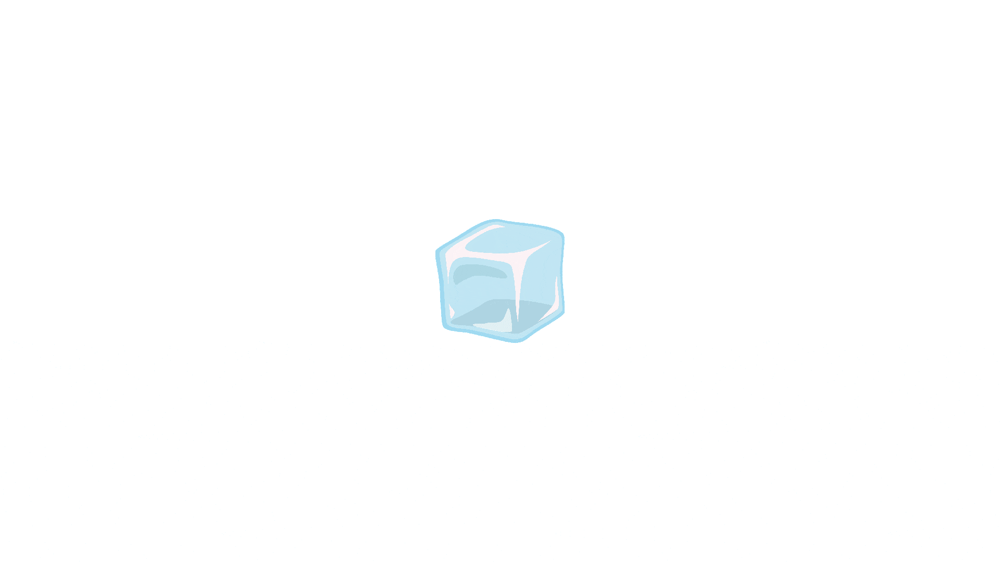

__WIP: SHAREABLE VERSION YET TO BE TESTED WITH EYETRACKER__

# Infant audiovisual PsychoPy experiment with eyetracking

(you can also see a [demo video on Vimeo](https://vimeo.com/705750840))

This is a [Psychopy](https://psychopy.org/) project consisting of a task where an infant is shown visual stimuli and simultaneously played auditory stimuli, while an eyetracker records their gaze.

In each trial of the experiment, the participant is shown an attention grabbing visual stimulus. Once the participant shifts their gaze towards the middle of the screen, a sound is played and shortly thereafter four images are displayed for a few seconds. Finally, a blank screen is displayed for a short duration until the trial ends.

Every 8th trial is followed by a 'distraction video' whose sole purpose is to keep the infant engaged in the task by making the experiment less monotonous.

## Hardware requirements
* An OK, not overly old (say pre-2012) computer - the original experiment was run on a Lenovo Legion 5 laptop, but this has far better performance than is really required.
* An eyetracker connected to the computer and turned on, unless you simulate an eyetracker with your mouse (see 'Eyetracker setup' section below).
* Two monitors - one for displaying stimuli to the participant, and one for the experimenter where they can monitor participant gaze (if you simulate the eyetracker though, only one monitor is required).

## Version/setup information
This experiment was originally developed to be run on a Windows computer, with PsychoPy Standalone version 2021.2.2, and a Tobii eyetracker. It's highly recommended that you do comprehensive pilot testing before running it with actual participants. If you're able to, it's recommended that you try to update the experiment to work as well as possible with the most recent version of PsychoPy. Otherwise, the safest option is to simply use PsychoPy v2021.2.2. The 'stimuli preparation scripts' described above were run with Python 3.8.

## PsychoPy code
When you open up the project file ('infant_audiovisual_eyetrack.psyexp') with PsychoPy standalone, you'll find that there is a mix of PsychoPy components added through the GUI, and code snippets which implement special functionality necessary for the experiment, and also handle communication with the eyetracker. For more information about the code, read the embedded comments in the code snippets.

Many aspects of the experiment are configured in a particular __'setup' code snippet/component__:
1. Open up the .psyexp file with PsychoPy standalone.
2. Open up the setup routine's 'code_eyetracker_setup' code component.
3. In the 'Before Experiment' tab's code, you may change values relating to e.g. 'mocking' an eyetracker (see below) or the size of visual stimuli (`IMG_MAX_WIDTH`, etc.). The code comments (starting with `#`) explain what each value represents.

## Eyetracker setup
The latest versions of PsychoPy have seen large changes with regard to how eyetracking is handled. You may wish to update this experiment to be more in line with current changes. At a minimum, you will need to update the 'real_eyetracker_config.yaml' file with specifications for your eyetracker, and a value in the 'setup' code snippet:
1. Go to the 'setup' code snippet (see above).
2. In the 'Before Experiment' tab's code, change `EYETRACKER_HZ = 600` to `EYETRACKER_HZ = <eyetracker_recording_frequency>`.

### Eyetracker mocking
If you don't have an eyetracker but still want to try the experiment out, you can use a 'mock' eyetracker, where the 'gaze' is controlled by your mouse. In that case:
1. Go to the 'setup' code snippet (see above).
2. In the 'Before Experiment' tab's code, change `MOCK_ON = False` to `MOCK_ON = True`. Save and close the code component's window.
3. Go to the experiment settings (click the cogwheel icon). Go to the 'Screen' tab and replace the 'Monitor' field with a Monitor Center specification for your screen and set the 'Screen' field to 1 (since you'll only be using one screen).

### Eyetracker calibration
This experiment in itself does not include any eyetracker calibration, so do note that you will need to run a calibration before starting. There are various options for running ET calibration in PsychoPy - in the original study where this experiment was used, a modified version of yh-luo's [psychopy_tobii_infant](https://github.com/yh-luo/psychopy_tobii_infant) project was used.

## Running the experiment
1. Clone/download this project.
2. Set up the eyetracker (see 'Eyetracker setup' section above).
3. Open 'infant_audiovisual_eyetrack.psypexp' with PsychoPy.
4. Click the cogwheel ('Edit experiment settings') icon, go to the 'Screen' tab, and insert specifications appropriate for your monitor (if you haven't already, you also need to set up a monitor in Monitor Center).
5. In PsychoPy, go to the 'trial' routine and click the 'code_monitor_mirror' (bottommost) code component. Go to the 'Begin Experiment' tab. In the code editor, update line 15 with the size (width, height in pixels) specifications for the screen you'll use to monitor participant gaze. Close the code editor. (if you are simulating the eyetracker, you may skip this step)
4. Click the Play ('Run experiment') icon.

You should be shown a loading screen with an elephant first - here, all experiment images are preloaded (to prevent latency during the experiment), which might take 30-60 seconds. Please be patient. After everything is loaded, the experiment should start with a screen showing an attention grabber. Once the eyetracker records that participant (or 'mock eyetracker') gaze is directed at the attention grabber for 200ms, the first trial should start. The experiment then keeps going until all 56 trials are finished.

When running the experiment as is, you'll note that some stimuli look very odd, as they've been 'garbled' on purpose to make the experiment free to share - see below for more information.

The experimenter may interact with the experiment as it is running, see 'documentation/experimenter_actions_guide.md'.

## Stimuli
Note that you may wish to replace the stimuli to run your own version of the experiment. In that case especially, read the 'Stimuli preparation scripts' section below; you'll probably want to modify the code and compnents in the PsychoPy project as well.

Here, descriptions are given as if you were planning on replicating the original experiment.

### Visual stimuli
The visual stimuli consist of:
* Faces (photos)
    - From the [Chicago Face Database](https://www.chicagofaces.org/)(CFD). Note that the actual face images aren't included in this repository, for data sensitivity/copyright reasons. Please visit the CFD site to download their material and use it to replace the placeholder images in the subdirectories of 'stimuli/visual/social' yourself (look at the filenames to see which CFD images were used). If you do use the CFD material, __please remember to give credit as described on the CFD website__.
    - Include equal number of female and male faces.
    - The CFD includes data on ethnicity of faces. Focus wasn't on this at all in the original experiment, but faces were selected such that the ethnicity-related proportions would very roughly correspond to actual proportions in the population of Sweden in 2021.
* Man-made objects (photos)
    - For attributions, see 'stimuli/stimuli_attributions.xlsx'.
* Natural objects (photos)
    - For attributions, see 'stimuli/stimuli_attributions.xlsx'.
* Geometrical shapes (3D computer renditions)
    - These were designed and rendered by designer and engineering student Amanda Gren, using CAD software.

### Auditory stimuli
The auditory stimuli consist of:
* Swedish spoken words/exclamations
    - These were recorded by research assistants Andrietta Stadin and Oskar Allerstrand at Uppsala University.
    - Include recordings of both male and female voices.
* Various objects likely to be in the infant's daily surroundings
    - For attributions, see 'stimuli/stimuli_attributions.xlsx'.

### Distraction videos
The distraction videos that were used in the original experiment depicted three women dancing with balloons in their hands - I (Lowe) was asked to insert these by higher-ups, but their origin is unknown. If you'd like to reproduce the original experiment as closely as possible, please send an e-mail to datalowe@posteo.de to request the videos (and an additional effort to find their origin will be done). To make it easier to try the experiment out, garbled/vectorized versions of the original distraction videos are included in this repository ('stimuli/pause_videos').

### Stimuli preparation scripts
In the directory 'stimuli_preparation_scripts' there are a few Python scripts that were used when developing the original task for modifying the stimuli, e.g. cropping the CFD images. You may use these if you wish. There are also scripts for generating stimuli metadata files, which are used by the PsychoPy experiment to figure out e.g. where the stimuli are stored. You're very likely to want to run these metadata scripts (e.g. 'stimuli_preparation_scripts/compile_attention_audio_metadata.py'). For more information, read the docstrings at the top of the scripts. If you don't already know how to run stand-alone Python scripts, you will need to look up e.g. a tutorial on YouTube (or, you can manually modify the 'stimuli_specifications' directory files if you prefer).

## Experiment output
To learn about the output produced after running the experiment, see the guide 'documentation/experiment_output_guide.md'.

## Translation
For instructions on how the experiment can be translated, see the guide 'documentation/experiment_translation_guide.md'.

## Contributions
If you notice any problems with the experiment, please start a GitHub issue detailing them. The experiment is not actively developed and it's unlikely that I'll (Lowe) fix any reported errors, but it will help others who'd like to use the experiment know what to expect.

If you improve the experiment and would like to share your work, you are very welcome to start a GitHub pull request. I'll do my best to review and accept pull requests, though I probably won't have time to add to them myself.

If you create a modified (e.g. new set of stimuli) version of the experiment, you can send an e-mail to datalowe@posteo.de and I'll add a link to your work in this README.

## Attribution
If you use this project, either for a replication study or for creating a modified version of the experiment, please give proper attribution. There is no published study on this experiment yet, but in the meantime we ask you to __please include a link to this repository__ in any published articles or similar writings.

For details on where experiment stimuli are originally from, see the files 'stimuli/audio/stimuli_attributions.xlsx' and 'stimuli/visual/stimuli_attributions.xlsx'. Some of the stimuli files require attribution, so if you reupload any of the stimuli (e.g. for sharing a modified version of the experiment), make sure to include the attributions as well.

The experiment was programmed at Karolinska Institutet by Lowe Wilsson according to instructions from, and after discussions with, Terje Falck-Ytter, Ana Maria Vaz Portugal Da Silva and Johan Lundin Kleberg. Andrietta Stadin provided valuable feedback and suggestions for improvements. Amanda Gren created the geometric shapes stimuli. Andrietta Stadin and Oskar Allerstrand made audio recordings. Wilsson collected and prepared all other stimuli.